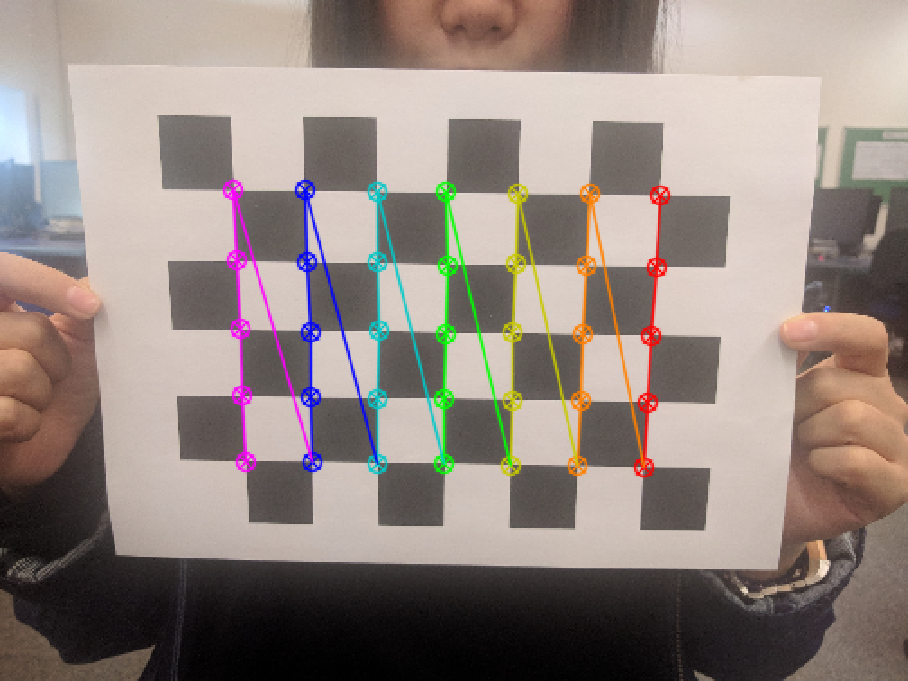
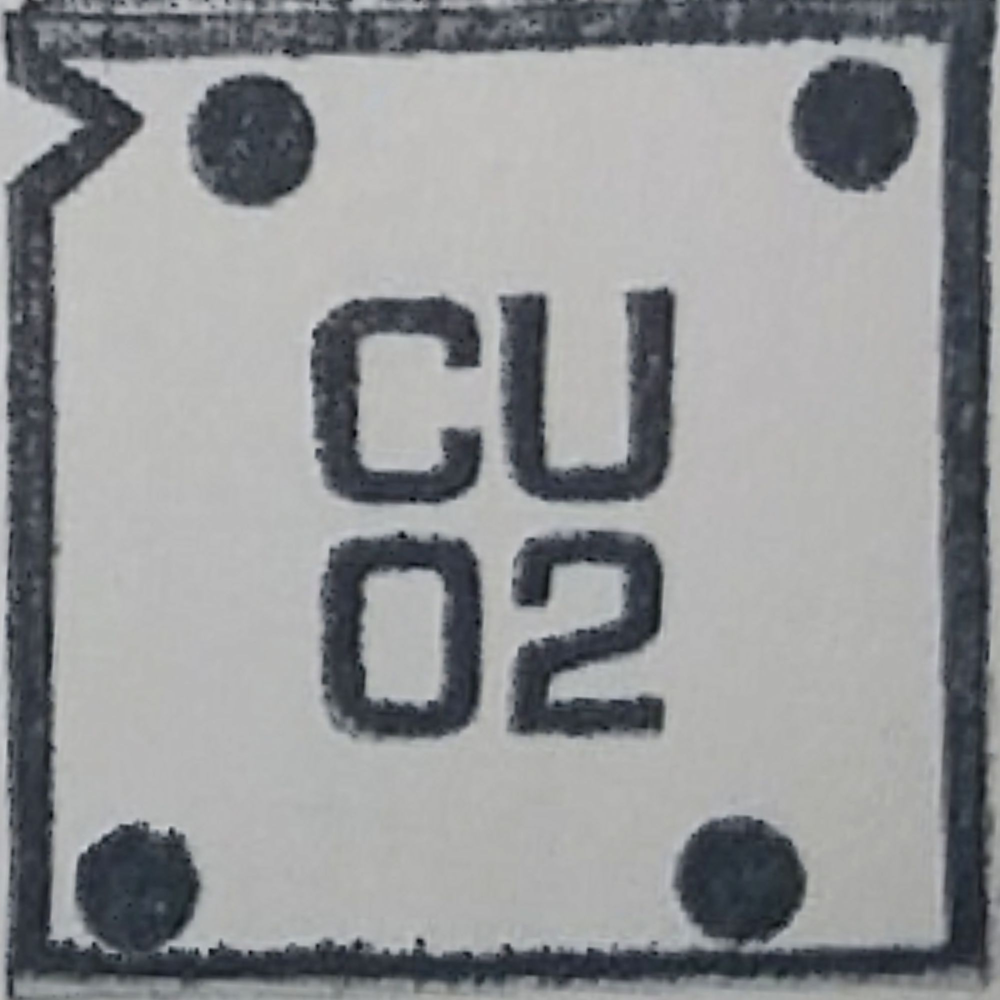
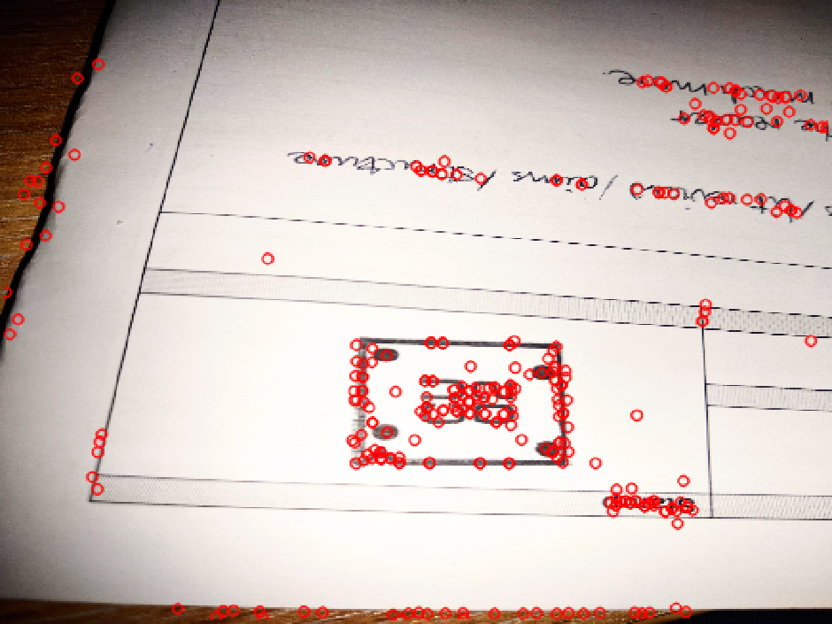
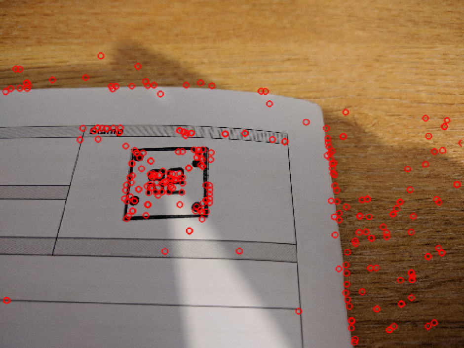
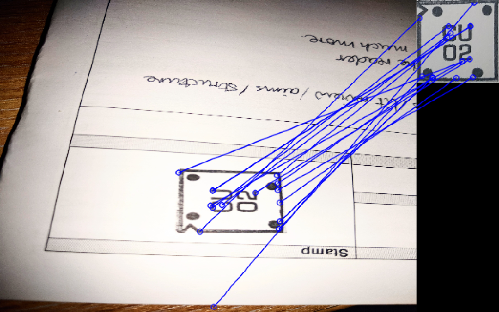
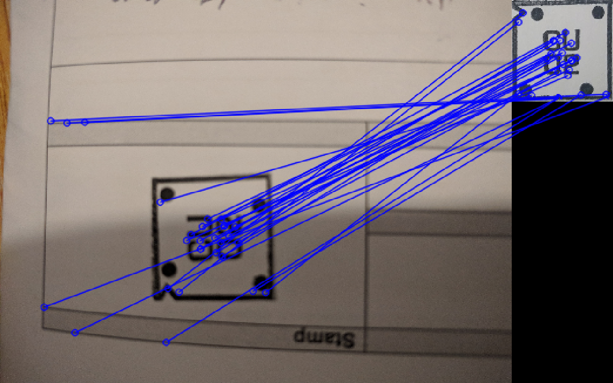
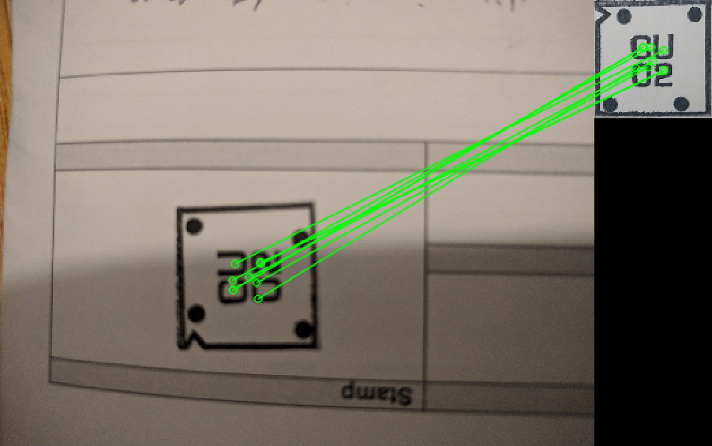
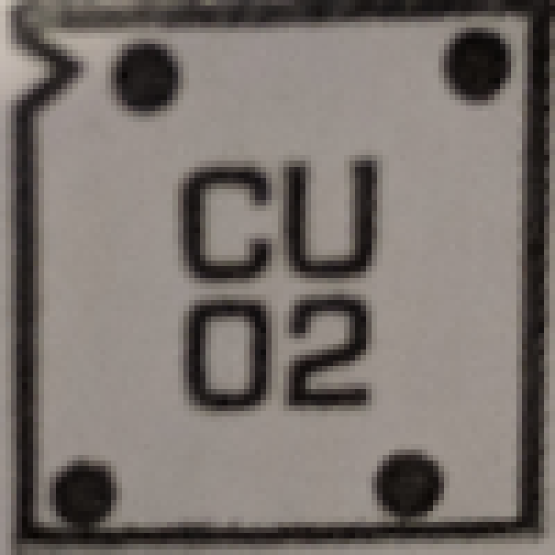
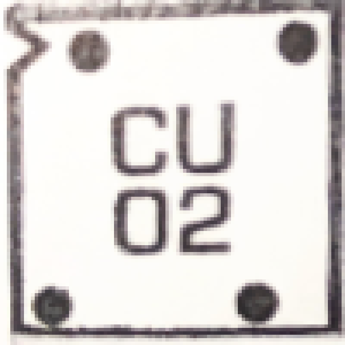

= L44 computer Vision Report for Exercise 1
Dingcheng Yue (dy276@cam.ac.uk)

:stem: asciimath

== Part 1: Camera Calibration

=== Model explanation

For Camera Calibration, there are many possible optical distortions including
radial distortions, chromatic calibrations. However, if we assume that these
optical distortions are negligible, we could establish the following
relationship using pinhole camera model.

[stem#camera]
++++
[[us], [vs], [s]] = K[R|T] [[x], [y], [z], [1]]
++++

Here we use homogeneous coordinates for this relationship. Here stem:[(x,y,z)]
is the coordinate of a point in the 3D world. And stem:[(u,v)] is the pixel
coordinate of the corresponding point projecting on the image plane. We could
parametrise this projection by multiplying 2 matrix stem:[K] and stem:[[R|T]]
which are camera's intrinsic parameters and extrinsic parameters respectively.

stem:[K] would be written as

[stem#K]
++++
K = [[f * m_x, gamma, u_0], [0, f * m_y, v_0], [0, 0, 1]]
++++

Here, stem:[f] is the focal length, stem:[m_x, m_y] are the scale factors
relating to pixels to focal length. stem:[gamma] are the skew coefficient between
x and y axis. stem:[u_0, v_0] represent the principle point corresponding to the
center respect to all the pixel coordinates. The parameters are specific to the
camera, and will remain the same across different images.

The extrinsic matrix could be written as

[stem#R]
++++
T = [[x],[y],[z]],
R = [[1,0,0],[0,cos(T_1),-sin(T_1)],[0,sin(T_1),cos(T_1)]]
[[cos(T_2),0,sin(T_2)],[0,1,0],[-sin(T_2),0,cos(T_2)]]
[[cos(T_3),-sin(T_3),0],[sin(T_3),cos(T_3),0],[0,0,1]]
++++

The extrinsic parameters is made up of of a translational components stem:[T]
(3DOF) and a rotational matrix stem:[R] (3DOF). This combination determines
where is the focal point of the camera in the world and on what angle it takes
the image.

There are also optics distortions. For opencv calibrations algorithm, it also
takes into account the radial distortions and tangential distortions which could
be approximated by 6 parameters stem:[k_1, k_2, p_1, p_2, k_3].

The opencv library use the checkerboard images to determine the intrinsic
parameters of the matrix. It first takes several images of a chessboard at
different position. For each grid point on the chessboard, opencv library could
easily find the pixel coordinates with respect to each of the image using corner
detection and chessboard constraint. For my experiment, I use the checkerboard
of size stem:[8xx6].

.corner detected on a checkerboard
[#img-checkboard.text-center]
--

image:result/checkerboard2.png[checkboard,200,auto]
--

For all images, the intrinsic camera position and the world coordinates of each
point remains constant. We could setup for each point across all images with the
following equation given the pinhole camera model:

[stem]
++++
(x_(im)-u_0)(T_2^TP_w+T_y)-(y_(im)-v_0)alpha(R_1^TP_w+T_x) = 0
++++

where stem:[x_(im), y_(im)] are pixel coordinate and stem:[P_w] are the world
coordinates. With enough equations, we could solve a system of equation with
unknowns: stem:[R_2^T, T_y, alpha R_1^T, alpha T_x]. Thus, we could get the
remaining results following on.

== Parameter Estimation

For our experiment, here are the approximated intrinsic matrix.

[stem]
++++
{:
(f*m_x ,=, 4.573xx10^3),
(f*m_y ,=, 1.015xx10^3),
(gamma ,=, 0),
(u_0 ,=, 2.625xx10^2),
(v_0 ,=, 2.011xx10^2)
:}
++++

We also got the none linear distortions parameters:

[format="csv", options="header"]
|===
id, T1, T2, T3, X, Y, Z
1, 0.2226,  1.915, 2.02, 1.987, -2.001, 77.29
2, 0.2429,  1.893, 2.019, 1.872,  -2.953, 75.20
3, -0.3078, -2.020,  1.697, 1.167,  -7.333, 38.00
4, 0.07550, -2.058,  2.176, 1.467, -0.6657, 96.37
5, -0.5890, -1.760,  1.676, 1.693,  -6.797, 102.6
|===

== Part 2 Perspective Projection

[NOTE]
.Alternative Approach Note
====
For this problem, I used to have harris corner detector to detect the corner of
the image, and I used the fact that the four corners of my stamp could easily
form a reasonable square, however, the method is not as robust as feature
mapping. Thus, it is not presented in the write up. Details of this
implementation was still kept in the code `hw1.py`.
====

=== Process

We first take a reference image that we want to wrap our stamp to.

[#img-ref.text-center]
--

--

==== feature extraction

For this, I first create extract the points of interests using `SIFT`. In
`SIFT` method, the keypoints are from the extrema of the difference of Gaussian
from multiple scales. It then stores as keypoint descriptor by a set of
historgram so that it is robust to affine transformation and illumination
changes. Here are the results after keypoints matching. I use the
`sift.detectAndCompute` function for this task.

.key points matching
[#img-kp.text-center]
--
image:result/keypoints1.png[kp1,200,auto]

image:result/keypoints3.png[kp3,200,auto]

--

==== feature matching

The next step is to match the features from the image to the ideal warp image.
We try to find to find corresponding features that are most similar to the ideal stamp
image. To speed up process, we used *FLANN* to match features. We also filter
out of matching pairs whose similar has less than 0.7. We then have the
following image:

.feature matching
[#img-fm.text-center]
--
image:result/featurematch01.png[fm1,200,auto]

image:result/featurematch05.png[fm5,200,auto]
--

==== Find Perspective Transformation with RANSAC

Calculating a perspective transformation matrix requires only 4 points, but we
have more points than necessary, and we also have many mismatches in the image.
We use a statistical method called *Random Sample Consensus* to filter out
outliers. We called the function `homography` for this.

.matches without outliers
[#img-match.text-center]
--
image:result/featurematch1.png[fm1,200,auto]
image:result/featurematch2.png[fm2,200,auto]

image:result/featurematch5.png[fm5,200,auto]
--

==== Perspective Transformation

Lastly after we find the matching points, we could easily transform the stamp
using the calculated homography matrix using `warpPerspective` function.

.final transformation
[#img-final.text-center]
--

image:result/topdown3.png[td3,100,auto]
image:result/topdown5.png[td5,100,auto]
--

=== Questions

[quote]
____
Under what conditions are 3, rather than 4 or more, points on the object suffice
to perform a perspective correction?
____

Given only three points, we could determine 6 degrees of freedom. As a
general perspective transformation, there will be 8 degrees of freedom. However,
if the stamp is far away from the camera, we could invoke weak perspective
assumption, i.e. all points lie at approximately the same depth from the
camera. In this assumption, the perspective transformation could be approximated
as the affine transformation and three points would be suffice.

[quote]
____
How could the knowledge of the intrinsic matrix and extrinsic camera parameters
lead to an improved solution?
____

With the knowledge of the intrinsic matrix and extrinsic camera parameters, we
could accurately construct the perspective matrix without fitting the matching
points. Suppose the intrinsic matrix is stem:[K] and the extrinsic parameters of
the stamp image is stem:[[R_1|T_1\]], and for a top down view of the stamp we
could take image at stem:[[R_2|T_2\]]. And the world coordinate is stem:[P], and
the pixel coordinates are respectively stem:[V_1] and stem:[V_2], then we have:

[stem]
++++
{:
(V_1 ,=, K[R_1|T_1]P),
(V_2 ,=, K[R_2|T_2]P)
:}
++++

And, thus we could easily derive our perspective wrapping matrix
stem:[K[R_1|T_1\][R_2^T|-R_2^T T_2\]K^(-1)] without the need for point match.
This is an improved solution since it gets rid of all the error caused by point
matching.

[stem]
++++
{:
(V_1 = K[R_1|T_1][R_2|T_2]^(-1)K^(-1) V_2),
(V_1 = K[R_1|T_1][R_2^T|-R_2^T T_2]K^(-1)V_2)
:}
++++

